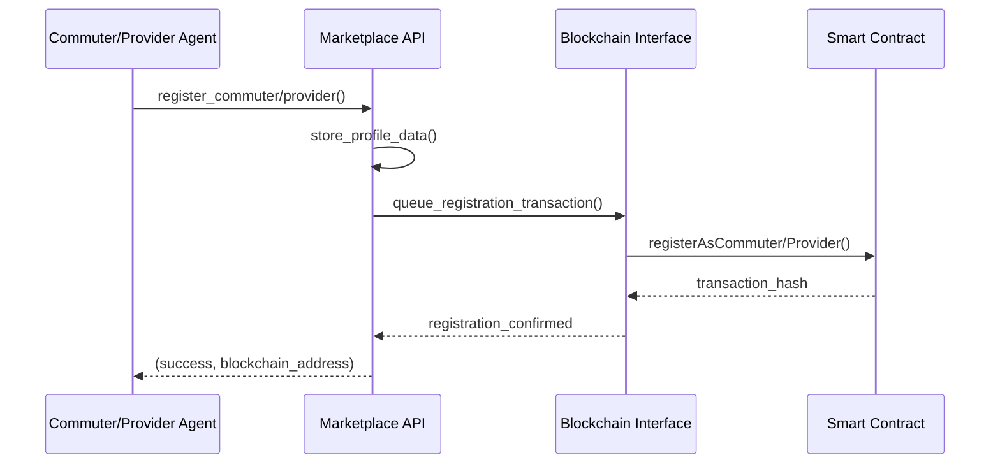
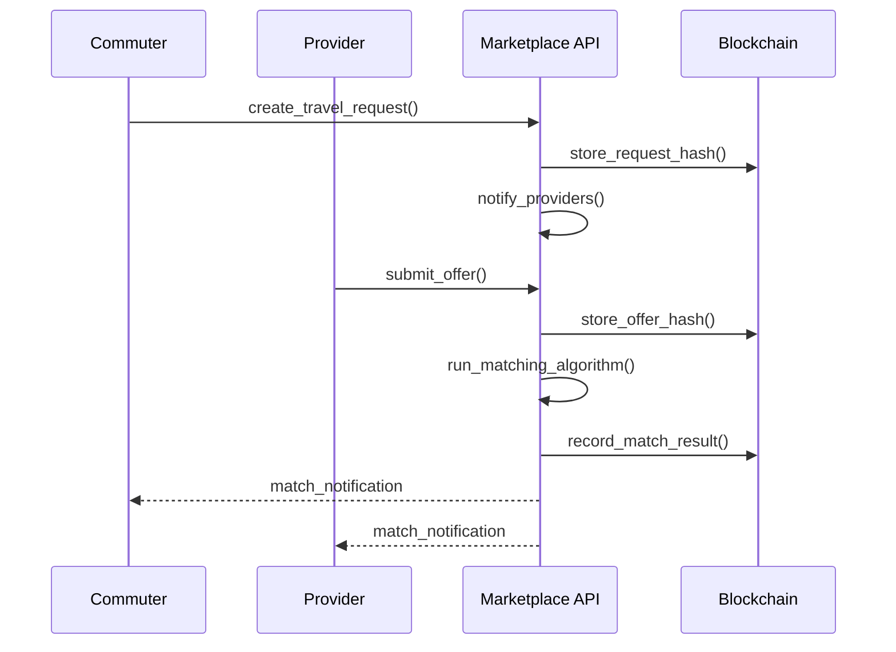

# Technical Implementation Guide

## 🏗️ System Architecture Deep Dive

### Multi-Layer Architecture

```
┌─────────────────────────────────────────────────────────────┐
│                    User Interface Layer                     │
│                  (Future: Web/Mobile App)                   │
├─────────────────────────────────────────────────────────────┤
│                  Agent-Based Model Layer                    │
│  ┌─────────────────┐    ┌─────────────────────────────────┐ │
│  │ Commuter Agents │    │     Provider Agents             │ │
│  │ - Demographics  │    │ - Service Types                 │ │
│  │ - Preferences   │    │ - Pricing Models                │ │
│  │ - Utility Calc  │    │ - Capacity Management           │ │
│  └─────────────────┘    └─────────────────────────────────┘ │
├─────────────────────────────────────────────────────────────┤
│                   Marketplace API Layer                     │
│  ┌─────────────────┐    ┌─────────────────────────────────┐ │
│  │ Request Manager │    │     Matching Engine             │ │
│  │ Offer Manager   │    │ - Algorithm Selection           │ │
│  │ Profile Storage │    │ - Optimization Logic            │ │
│  └─────────────────┘    └─────────────────────────────────┘ │
├─────────────────────────────────────────────────────────────┤
│                  Blockchain Interface Layer                 │
│  ┌─────────────────┐    ┌─────────────────────────────────┐ │
│  │ Transaction Mgr │    │     Smart Contracts             │ │
│  │ - Batching      │    │ - Registry                      │ │
│  │ - Nonce Mgmt    │    │ - Requests                      │ │
│  │ - Gas Optimize  │    │ - Auctions                      │ │
│  └─────────────────┘    └─────────────────────────────────┘ │
├─────────────────────────────────────────────────────────────┤
│                     Blockchain Layer                        │
│              (Ethereum/Hardhat Local Network)               │
└─────────────────────────────────────────────────────────────┘
```

## 🔄 Data Flow Architecture

### 1. User Registration Flow



### 2. Request-Offer-Match Flow



## 🧠 Agent Intelligence System

### Commuter Decision Making

#### Utility Function Implementation

```python
def calculate_option_utility(self, option, request_id):
    """
    Multi-factor utility calculation:
    U = w1*cost_utility + w2*time_utility + w3*comfort_utility + 
        w4*reliability_utility + w5*environmental_utility
    """
    
    # Cost utility (inverse relationship)
    cost_utility = 1.0 / (1.0 + option['price'] / self.income_factor)
    
    # Time utility (based on urgency)
    time_utility = 1.0 / (1.0 + option['duration'] / self.time_sensitivity)
    
    # Comfort utility (mode-specific)
    comfort_utility = self.comfort_preferences.get(option['mode'], 0.5)
    
    # Reliability utility
    reliability_utility = option.get('reliability_score', 0.5) / 100.0
    
    # Environmental utility
    env_score = self.environmental_scores.get(option['mode'], 0.5)
    
    # Weighted combination
    total_utility = (
        self.cost_weight * cost_utility +
        self.time_weight * time_utility +
        self.comfort_weight * comfort_utility +
        self.reliability_weight * reliability_utility +
        self.environmental_weight * env_score
    )
    
    return total_utility
```

#### Learning and Adaptation

```python
def update_preferences_from_experience(self, completed_trip):
    """
    Update agent preferences based on trip experience
    """
    mode = completed_trip['mode']
    satisfaction = completed_trip['satisfaction_score']
    
    # Adjust mode preferences
    if satisfaction > 0.7:
        self.mode_preferences[mode] *= 1.1  # Increase preference
    elif satisfaction < 0.3:
        self.mode_preferences[mode] *= 0.9  # Decrease preference
    
    # Normalize preferences
    total = sum(self.mode_preferences.values())
    for mode in self.mode_preferences:
        self.mode_preferences[mode] /= total
```

### Provider Pricing Strategy

#### Dynamic Pricing Algorithm

```python
def calculate_dynamic_price(self, request):
    """
    Dynamic pricing based on:
    - Distance
    - Demand/Supply ratio
    - Time of day
    - Provider capacity
    - Market competition
    """
    
    # Base price calculation
    distance = self.calculate_distance(request['origin'], request['destination'])
    base_price = self.base_rate + (distance * self.per_unit_rate)
    
    # Demand multiplier
    current_demand = self.get_current_demand_level()
    demand_multiplier = 1.0 + (current_demand - 0.5) * 0.5
    
    # Time-of-day multiplier
    time_multiplier = self.get_time_multiplier(request['start_time'])
    
    # Capacity multiplier
    capacity_utilization = 1.0 - (self.available_capacity / self.total_capacity)
    capacity_multiplier = 1.0 + capacity_utilization * 0.3
    
    # Competition adjustment
    competitor_prices = self.get_competitor_prices(request['request_id'])
    if competitor_prices:
        avg_competitor_price = sum(competitor_prices) / len(competitor_prices)
        competition_factor = min(1.2, avg_competitor_price / base_price)
    else:
        competition_factor = 1.0
    
    final_price = (base_price * demand_multiplier * 
                   time_multiplier * capacity_multiplier * 
                   competition_factor)
    
    # Add randomness for market dynamics
    final_price *= random.uniform(0.9, 1.1)
    
    return round(final_price, 2)
```

## 🔗 Blockchain Integration Details

### Transaction Management

#### Asynchronous Transaction Processing

```python
class TransactionManager:
    def __init__(self):
        self.transaction_queue = asyncio.Queue()
        self.nonce_lock = asyncio.Lock()
        self.current_nonce = 0
        
    async def process_transaction_batch(self, batch_size=10):
        """
        Process transactions in batches for efficiency
        """
        batch = []
        
        # Collect batch
        for _ in range(batch_size):
            if not self.transaction_queue.empty():
                tx = await self.transaction_queue.get()
                batch.append(tx)
        
        if not batch:
            return
        
        # Process batch sequentially to avoid nonce conflicts
        async with self.nonce_lock:
            for tx in batch:
                try:
                    tx.nonce = self.current_nonce
                    result = await self.send_transaction(tx)
                    self.current_nonce += 1
                    self.log_success(tx, result)
                except Exception as e:
                    self.log_failure(tx, e)
                    # Don't increment nonce on failure
```

#### Gas Optimization

```python
def optimize_gas_usage(self, transaction_data):
    """
    Optimize gas usage based on network conditions
    """
    
    # Get current gas price from network
    current_gas_price = self.w3.eth.gas_price
    
    # Adjust based on transaction urgency
    if transaction_data.urgency == 'high':
        gas_price = int(current_gas_price * 1.2)
    elif transaction_data.urgency == 'low':
        gas_price = int(current_gas_price * 0.8)
    else:
        gas_price = current_gas_price
    
    # Estimate gas limit
    try:
        gas_estimate = self.estimate_gas(transaction_data)
        gas_limit = int(gas_estimate * 1.1)  # 10% buffer
    except:
        gas_limit = self.default_gas_limit
    
    return gas_price, gas_limit
```

### Smart Contract Interaction

#### Contract Factory Pattern

```python
class ContractFactory:
    def __init__(self, w3, deployment_info):
        self.w3 = w3
        self.contracts = {}
        self.load_contracts(deployment_info)
    
    def load_contracts(self, deployment_info):
        """Load all contract instances"""
        for name, address in deployment_info.items():
            abi = self.load_abi(name)
            self.contracts[name] = self.w3.eth.contract(
                address=address, 
                abi=abi
            )
    
    def get_contract(self, name):
        """Get contract instance by name"""
        return self.contracts.get(name)
    
    def call_contract_function(self, contract_name, function_name, *args, **kwargs):
        """Generic contract function caller"""
        contract = self.get_contract(contract_name)
        function = getattr(contract.functions, function_name)
        return function(*args, **kwargs)
```

## 📊 Analytics and Monitoring

### Performance Metrics Collection

```python
class PerformanceMonitor:
    def __init__(self):
        self.metrics = {
            'transaction_times': [],
            'gas_usage': [],
            'success_rates': [],
            'throughput': [],
            'error_counts': defaultdict(int)
        }
    
    def record_transaction(self, tx_hash, start_time, end_time, gas_used, success):
        """Record transaction performance metrics"""
        duration = end_time - start_time
        self.metrics['transaction_times'].append(duration)
        self.metrics['gas_usage'].append(gas_used)
        
        if success:
            self.metrics['success_rates'].append(1)
        else:
            self.metrics['success_rates'].append(0)
    
    def calculate_tps(self, time_window=60):
        """Calculate transactions per second"""
        recent_transactions = [
            t for t in self.transaction_timestamps 
            if time.time() - t < time_window
        ]
        return len(recent_transactions) / time_window
    
    def generate_performance_report(self):
        """Generate comprehensive performance report"""
        return {
            'avg_tx_time': np.mean(self.metrics['transaction_times']),
            'avg_gas_usage': np.mean(self.metrics['gas_usage']),
            'success_rate': np.mean(self.metrics['success_rates']),
            'current_tps': self.calculate_tps(),
            'error_breakdown': dict(self.metrics['error_counts'])
        }
```

### Real-time Dashboard Data

```python
def get_dashboard_data(self):
    """Generate real-time dashboard data"""
    return {
        'system_status': {
            'blockchain_connected': self.w3.is_connected(),
            'active_agents': len(self.active_agents),
            'pending_transactions': self.transaction_queue.qsize(),
            'network_congestion': self.assess_network_congestion()
        },
        'transaction_metrics': self.performance_monitor.generate_performance_report(),
        'business_metrics': {
            'total_requests': len(self.marketplace_db['requests']),
            'total_matches': len(self.marketplace_db['matches']),
            'total_revenue': self.calculate_total_revenue(),
            'avg_trip_price': self.calculate_avg_trip_price()
        },
        'agent_statistics': {
            'commuter_satisfaction': self.calculate_avg_satisfaction(),
            'provider_utilization': self.calculate_provider_utilization(),
            'mode_distribution': self.get_mode_distribution()
        }
    }
```

## 🔧 Configuration Management

### Environment-Specific Configurations

```python
class ConfigManager:
    def __init__(self, environment='development'):
        self.environment = environment
        self.config = self.load_config()
    
    def load_config(self):
        """Load environment-specific configuration"""
        base_config = self.load_base_config()
        env_config = self.load_env_config(self.environment)
        
        # Merge configurations
        return {**base_config, **env_config}
    
    def get_blockchain_config(self):
        """Get blockchain-specific configuration"""
        return {
            'rpc_url': self.config['blockchain']['rpc_url'],
            'chain_id': self.config['blockchain']['chain_id'],
            'gas_limit': self.config['blockchain']['gas_limit'],
            'gas_price': self.config['blockchain']['gas_price'],
            'max_retries': self.config['blockchain']['max_retries']
        }
    
    def get_simulation_config(self):
        """Get simulation-specific configuration"""
        return {
            'num_commuters': self.config['simulation']['num_commuters'],
            'num_providers': self.config['simulation']['num_providers'],
            'simulation_steps': self.config['simulation']['steps'],
            'grid_size': self.config['simulation']['grid_size']
        }
```

## 🚀 Deployment and Scaling

### Docker Containerization

```dockerfile
# Dockerfile
FROM node:18-alpine AS contracts
WORKDIR /app
COPY package*.json ./
RUN npm install
COPY contracts/ ./contracts/
COPY hardhat.config.js ./
RUN npx hardhat compile

FROM python:3.12-slim AS runtime
WORKDIR /app
COPY requirements.txt ./
RUN pip install -r requirements.txt
COPY --from=contracts /app/artifacts ./artifacts/
COPY abm/ ./abm/
COPY scripts/ ./scripts/
COPY *.json ./

EXPOSE 8000
CMD ["python", "abm/agents/run_decentralized_model.py"]
```

### Kubernetes Deployment

```yaml
# k8s-deployment.yaml
apiVersion: apps/v1
kind: Deployment
metadata:
  name: maas-simulation
spec:
  replicas: 3
  selector:
    matchLabels:
      app: maas-simulation
  template:
    metadata:
      labels:
        app: maas-simulation
    spec:
      containers:
      - name: simulation
        image: maas-decentralized:latest
        ports:
        - containerPort: 8000
        env:
        - name: BLOCKCHAIN_RPC_URL
          value: "http://blockchain-node:8545"
        - name: ENVIRONMENT
          value: "production"
```

## 🔍 Testing Strategy

### Unit Testing

```python
class TestBlockchainInterface(unittest.TestCase):
    def setUp(self):
        self.blockchain_interface = BlockchainInterface(test_mode=True)
        self.mock_commuter = create_mock_commuter()
    
    def test_commuter_registration(self):
        """Test commuter registration flow"""
        success, address = self.blockchain_interface.register_commuter(
            self.mock_commuter
        )
        
        self.assertTrue(success)
        self.assertIsNotNone(address)
        self.assertTrue(self.blockchain_interface.is_commuter_registered(
            self.mock_commuter.unique_id
        ))
    
    def test_request_creation(self):
        """Test travel request creation"""
        request = create_mock_request()
        success, request_id = self.blockchain_interface.create_travel_request(
            self.mock_commuter, request
        )
        
        self.assertTrue(success)
        self.assertIsNotNone(request_id)
```

### Integration Testing

```python
class TestEndToEndFlow(unittest.TestCase):
    def test_complete_booking_flow(self):
        """Test complete booking from request to settlement"""
        
        # 1. Register users
        commuter = create_test_commuter()
        provider = create_test_provider()
        
        # 2. Create request
        request_id = commuter.create_request([0, 0], [10, 10], time.time())
        
        # 3. Submit offer
        provider.submit_offer_for_request(request_id)
        
        # 4. Run matching
        success, match = self.marketplace.run_marketplace_matching(request_id)
        
        # 5. Verify results
        self.assertTrue(success)
        self.assertIsNotNone(match)
        self.assertEqual(match['request_id'], request_id)
```
